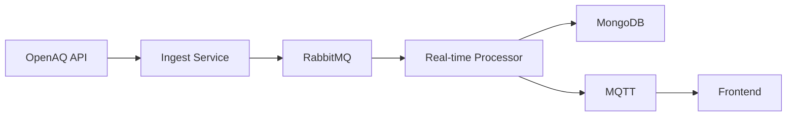
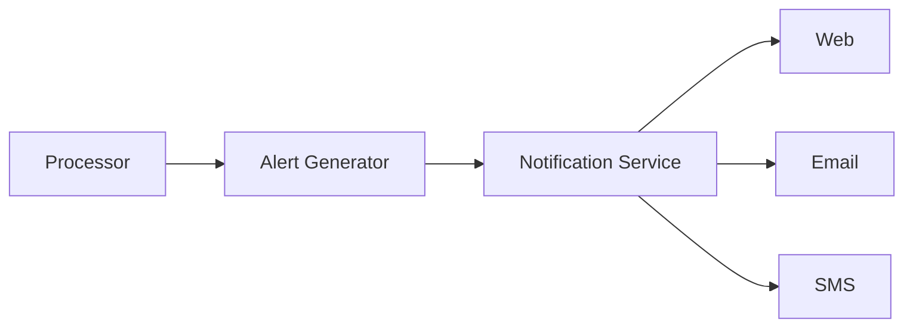

# Σύστημα Παρακολούθησης Ποιότητας Αέρα
## Αναφορά Υλοποίησης

## Περίληψη

Το παρόν σύστημα αναπτύχθηκε για την παρακολούθηση της ποιότητας του αέρα σε πραγματικό χρόνο, με έμφαση στη μέτρηση των σωματιδίων PM2.5. Το σύστημα ενσωματώνει δεδομένα από το OpenAQ API, τα επεξεργάζεται μέσω μιας αρχιτεκτονικής μικροϋπηρεσιών και τα παρουσιάζει μέσω μιας σύγχρονης διαδικτυακής διεπαφής.

## 1. Πηγή Δεδομένων και Αποθήκευση

### 1.1 OpenAQ API
Το OpenAQ API παρέχει πρόσβαση σε δεδομένα ποιότητας αέρα από πάνω από 100 χώρες. Χρησιμοποιούμε τα εξής endpoints:
- `/v2/measurements`: Για μετρήσεις σε πραγματικό χρόνο
- `/v2/locations`: Για πληροφορίες θέσης
- `/v2/countries`: Για μεταδεδομένα χωρών

### 1.2 Δομή Αποθήκευσης
Τα δεδομένα αποθηκεύονται σε MongoDB με το εξής σχήμα:

```json
{
  "measurement": {
    "location": {
      "coordinates": [longitude, latitude],
      "city": "string",
      "country": "string"
    },
    "parameter": "PM2.5",
    "value": number,
    "unit": "µg/m³",
    "timestamp": ISODate
  },
  "alert": {
    "severity": "info|warning|alert|critical",
    "threshold": number,
    "timestamp": ISODate,
    "acknowledged": boolean,
    "comment": string
  }
}
```

## 2. Επεξεργασία και Φιλτράρισμα

### 2.1 Διαδικασία Επεξεργασίας
1. **Λήψη Δεδομένων**
   ```
   OpenAQ API → Υπηρεσία Εισαγωγής → RabbitMQ → Επεξεργαστής ΠΧ
   ```

2. **Φιλτράρισμα**
   - Έλεγχος εγκυρότητας τιμών
   - Απορρίψεις εκτός ορίων
   - Κανονικοποίηση μονάδων

3. **Εξαγωγή Γεγονότων**
   - Υπολογισμός μέσων όρων
   - Έλεγχος ορίων
   - Δημιουργία ειδοποιήσεων

### 2.2 Ορισμός Ορίων
Χρησιμοποιούμε τα όρια της WHO για PM2.5:

| Σοβαρότητα | Τιμή (µg/m³) | Δικαιολόγηση |
|------------|--------------|--------------|
| Πληροφόρηση | 10 | Μέση ημερήσια τιμή WHO |
| Προειδοποίηση | 25 | 2.5x μέση τιμή |
| Ειδοποίηση | 35 | 3.5x μέση τιμή |
| Κρίσιμο | 50 | 5x μέση τιμή |

## 3. Κανόνες Πραγματικού Χρόνου

### 3.1 Μορφή Κανόνα
```json
{
  "condition": {
    "parameter": "PM2.5",
    "operator": ">",
    "threshold": number,
    "duration": "5m"
  },
  "action": {
    "type": "alert",
    "severity": "string",
    "channels": ["web", "email", "sms"]
  }
}
```

### 3.2 Παραμετροποίηση Ειδοποιήσεων
Το επιχειρηματικό μοντέλο βασίζεται σε επίπεδα συνδρομής:

| Επίπεδο | Χαρακτηριστικά |
|---------|----------------|
| Βασικό | Web ειδοποιήσεις, 3 θέσεις |
| Premium | Email + SMS, 10 θέσεις |
| Enterprise | Custom κανόνες, απεριόριστες θέσεις |

## 4. Ροές Συστήματος

### 4.1 Ροή Δεδομένων


### 4.2 Ροή Ειδοποιήσεων


## 5. Υλοποίηση

### 5.1 Αρχιτεκτονική
Το σύστημα ακολουθεί μικροϋπηρεσίες:

1. **Frontend**
   - React + TypeScript
   - Leaflet.js για χάρτη
   - MQTT.js για πραγματικό χρόνο

2. **Backend**
   - FastAPI
   - MongoDB
   - RabbitMQ
   - MQTT Broker

3. **Υποδομή**
   - Docker
   - Nginx
   - MongoDB
   - RabbitMQ

### 5.2 Διαχείριση Προτιμήσεων
```json
{
  "user_preferences": {
    "alert_levels": ["warning", "alert", "critical"],
    "locations": ["Athens", "Thessaloniki"],
    "channels": ["web", "email"],
    "thresholds": {
      "warning": 25,
      "alert": 35,
      "critical": 50
    }
  }
}
```

## 6. Προκλήσεις και Λύσεις

### 6.1 Τεχνικές Προκλήσεις
1. **Πραγματικός Χρόνος**
   - Πρόκληση: Αξιοπιστία ενημερώσεων
   - Λύση: MQTT για ελαφρύ messaging
   - Αποτέλεσμα: Ελάχιστη καθυστέρηση

2. **Συνέπεια Δεδομένων**
   - Πρόκληση: Διασυνοριακή συνέπεια
   - Λύση: Message queuing
   - Αποτέλεσμα: Αξιόπιστη ροή

### 6.2 Βελτιστοποιήσεις
1. **Frontend**
   - Αποδοτικά React components
   - Βελτιστοποίηση χάρτη
   - Error boundaries

2. **Backend**
   - Βελτιστοποίηση queries
   - Κατάλληλο indexing
   - Caching

## 7. Μελλοντικές Ενισχύσεις

### 7.1 Προγραμματισμένες Λειτουργίες
1. **Σύστημα Ειδοποιήσεων**
   - Email/SMS
   - Web push
   - Custom κανόνες

2. **Ανάλυση**
   - Προηγμένη τάση
   - Custom dashboards
   - Προβλεπτική ανάλυση

### 7.2 Κλιμάκωση
1. **Υποδομή**
   - Οριζόντια κλιμάκωση
   - Load balancing
   - Database sharding

2. **Απόδοση**
   - Βελτιστοποίηση queries
   - Caching
   - Διαχείριση πόρων

## 8. Συμπέρασμα

Το σύστημα πληροί τις απαιτήσεις για:
- Παρακολούθηση πραγματικού χρόνου
- Ειδοποιήσεις
- Διαχείριση προτιμήσεων
- Ιστορικό δεδομένων

### 8.1 Επόμενα Βήματα
1. **Άμεσες Προτεραιότητες**
   - Επιπλέον κανάλια ειδοποιήσεων
   - Βελτίωση ανάλυσης
   - Βελτίωση διεπαφής

2. **Μακροπρόθεσμοι Στόχοι**
   - Mobile εφαρμογή
   - Machine learning
   - Διεθνοποίηση 